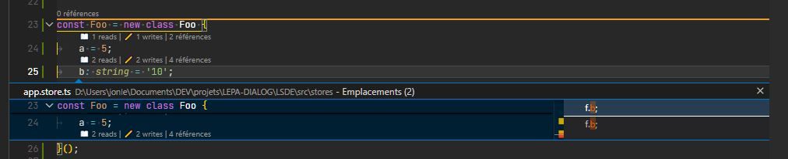

# Property Read/Write CodeLens

A VS Code extension that displays CodeLens on class properties, showing the number of reads and writes.

## ✨ Features

- **📖 Read count**: Shows how many times a property is read
- **✏️ Write count**: Shows how many times a property is written
- **🔍 Quick navigation**: Click on the CodeLens to see filtered references
- **🚀 Full support**: JavaScript and TypeScript (with types, modifiers, etc.)

## 📸 Preview



## 🎯 Supported Syntaxes

### TypeScript

```typescript
class MyClass {
	a: number = 5;
	b?: string = "hello";
	public readonly c: number = 10;
	private static d: string;
	protected abstract e: boolean;
}
```

## 🚀 Installation

1. Open VS Code
2. Go to the Extensions tab (Ctrl+Shift+X)
3. Search for "Property Read/Write CodeLens"
4. Click "Install"

## 📝 Usage

1. Open a JavaScript or TypeScript file containing classes
2. CodeLens will automatically appear on class properties
3. Click on "📖 X reads" to see only read references
4. Click on "✏️ X writes" to see only write references

## ⚙️ Configuration

No configuration required! The extension works automatically.

## 🐛 Known Issues

- no yet known issues

## 🤝 Contributing

Contributions are welcome! Feel free to open issues or pull requests.

## 📄 License

MIT

## 🔗 Links

- [GitHub Repository](https://github.com/votre-username/property-read-write-codelens)
- [Report a bug](https://github.com/votre-username/property-read-write-codelens/issues)

---

**Enjoy better visibility of your class properties while coding!** 🎉
