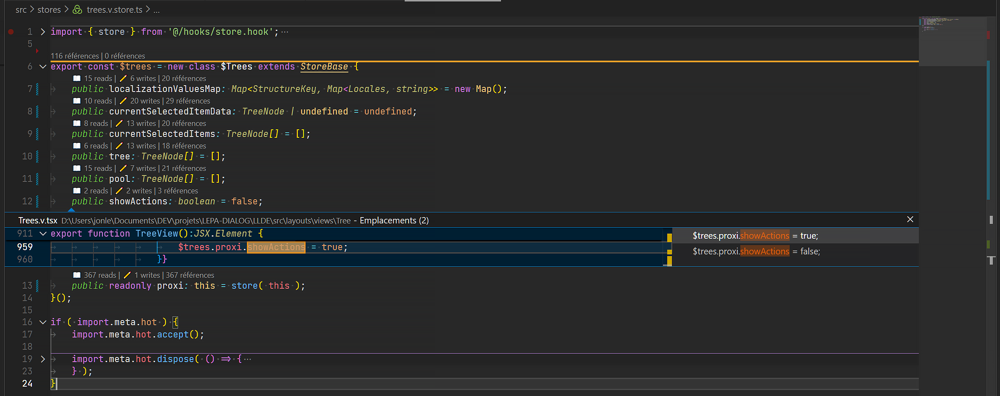
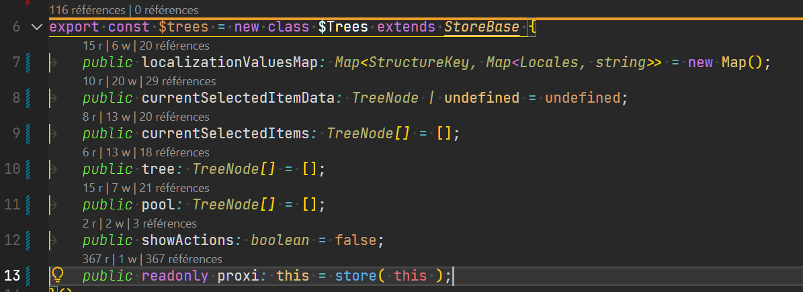

# Property Read/Write CodeLens

A lightweight VS Code extension to display the number of 📖reads and ✏️writes for class properties in JavaScript and TypeScript files.

## why
Have you ever exhibited an unintended behavior, knowing it was likely linked to a value write operation somewhere?

If the answer is yes, you’ve probably already used your IDE’s regex filters to scrutinize each of the ~100< assignments across your architecture, or used VSCode’s native service that aggregates all types of merged operations.

This extension simply waits for native CodeLens to retrieve the information, then splits it into two sections so you can view assignments and reads separately for debugging your strange behavior more easily.

## Features

- **Read and Write Counts**: Instantly see how many times a property is read or written.
- **Quick Navigation**: Click on the CodeLens to view references directly.
- **Full Support**: Works seamlessly with JavaScript and TypeScript.

## Configuration

The extension works out of the box. Optional settings are available to customize the display:

- Toggle visibility of read | write counts.
- Customize emojis 📖 and ✏️ and text for CodeLens.

## Installation

1. Open VS Code.
2. Go to the Extensions tab (Ctrl+Shift+X).
3. Search for "Property Read/Write CodeLens".
4. Click "Install".

## Usage

1. Open a JavaScript or TypeScript file.
2. CodeLens will appear above class properties, showing read and write counts.
3. Click on the counts to navigate to the references.

## Contributing

Contributions are welcome! Open an issue or submit a pull request on GitHub.

## Changelog

see [CHANGELOG.md](CHANGELOG.md)

## TODO:
- Add support for more options with regex for complex properties assignments ex:  `entity.set({property: value })` as writes references.
this can prove very useful in architectures such as ECS, in game engines where coupling occurs through facades.
For now, this type of designation is considered a read operation.
Users will be allowed to add a special regex to detect this type of assignment as a write operation.

## License

MIT

